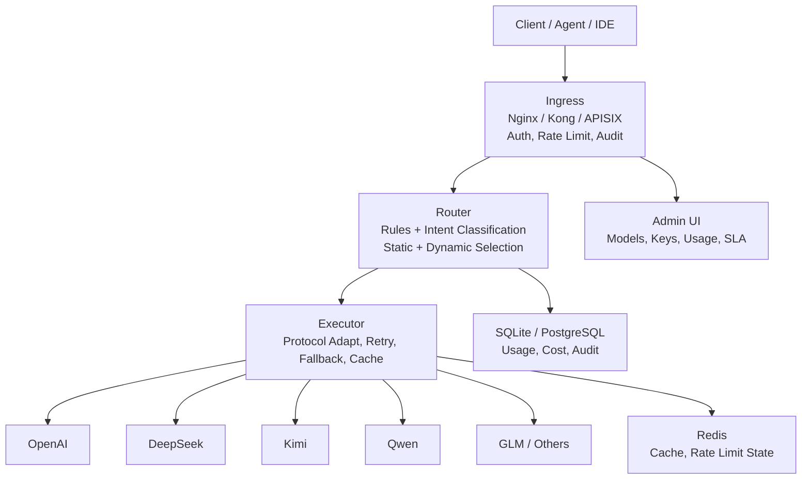

<p align="center">
  <h1 align="center">LLM Gateway</h1>
  <p align="center">
    <a href="https://github.com/xuehaoweng/Keystone/actions/workflows/ci.yml"></a>
    
    
    
  </p>
  <p align="center">
    <b>Unified LLM routing gateway with intelligent tier-based routing, cost control, and multi-protocol compatibility.</b><br/>
    <b>统一的大模型路由网关，提供智能分层路由、成本治理和多协议兼容。</b>
  </p>
  <p align="center">
    <a href="#quick-start">Quick Start</a> •
    <a href="#features">Features</a> •
    <a href="#why-not-litellm">Why not LiteLLM?</a> •
    <a href="#usage">Usage</a> •
    <a href="#architecture">Architecture</a> •
    <a href="README.zh-CN.md">中文文档</a>
  </p>
</p>

---

## What It Solves

- **Unified Entry**: One API for all LLM providers — business teams don't need to integrate with each vendor separately.
- **Cost Visibility**: Track token usage and estimated costs per API Key, user, model, and tier.
- **Auto Fallback**: When a provider rate-limits or fails, the gateway retries, circuits-breaks, and falls back automatically.
- **Permission Isolation**: Interns, test scripts, and core business can use different Keys with different QPS, quotas, and model tiers.
- **Resource Matching**: Simple tasks go to cheap models; complex tasks go to expensive models — avoid overpaying.
- **Production Governance**: Built-in call traces, audit logs, provider SLA dashboards, policy drafts, and structured Nginx logging.

## Quick Start

```bash
git clone <repo>
cd llm_gateway
cp .env.example .env
# Edit .env with your provider API keys
docker compose up -d --build --force-recreate
```

Open the admin console:
```text
http://localhost:8000/login
```

Create a demo key:
```bash
docker compose exec gateway python scripts/setup_test_key.py
# Use lgw_test_key_2026 in the admin UI
```

## Features

| Feature | Description |
|---------|-------------|
| **OpenAI-Compatible API** | Drop-in `/v1/chat/completions` endpoint for any OpenAI SDK client |
| **Anthropic-Compatible API** | Native `/v1/anthropic` endpoint for Claude Code and Anthropic SDK |
| **Native Gateway API** | `/api/runs` with route metadata, intent classification, and rule engine |
| **Intent Classification** | AI-powered prompt analysis routes simple tasks to cheap models, complex tasks to expensive models (~10ms overhead) |
| **Static Rules Engine** | Tool-based, keyword-based, and content-length routing rules |
| **Tier-Based Access Control** | `cheap` / `expensive` tiers with per-key enforcement |
| **Auto Fallback** | Non-streaming requests retry next healthy model on failure |
| **Circuit Breaker** | Continuous failures trigger cooldown; automatic recovery |
| **Result Cache** | Low-temperature non-streaming responses cached in Redis |
| **Usage Tracking** | Per-key token usage, latency, and cost estimates persisted to SQLite |
| **Admin Dashboard** | React-based UI for keys, models, routing rules, test console, and SLA monitoring |
| **Multi-Provider** | OpenAI, Anthropic, DeepSeek, Kimi (incl. Code membership), Qwen, GLM, Lingya |

## Why not LiteLLM?

| | **This Gateway** | **LiteLLM** |
|---|---|---|
| **Intent Routing** | AI classifies prompt complexity and routes to cheap/expensive tier | Weighted round-robin only |
| **Static Rules** | Tool/keyword/length-based rules for deterministic routing | No built-in rule engine |
| **Tier Enforcement** | Per-key `allowed_tiers` with automatic matching | Budget controls only |
| **Database** | SQLite works out of the box | PostgreSQL required for admin features |
| **Weight** | Single Docker image, minimal dependencies | Larger Python dependency tree |
| **Chinese Providers** | First-class support for DeepSeek, Kimi, Qwen, GLM, Lingya | Via community adapters |

Use **LiteLLM** when you need 100+ providers, team management, and a huge community.  
Use **this gateway** when you want intelligent cost-aware routing, tier-based governance, and lightweight deployment with strong Chinese provider support.

## Usage

### OpenAI SDK (Cursor, Continue, Copilot, etc.)

```python
import openai

client = openai.OpenAI(
    api_key="lgw_xxx",
    base_url="http://localhost:8000/v1",
)

# Omit model to let the gateway auto-route via intent classification
client.chat.completions.create(
    messages=[{"role": "user", "content": "Explain quantum computing"}],
    stream=True,
)
```

### Claude Code

```bash
# Option 1: OpenAI-compatible mode
claude config set apiProvider openai
claude config set apiUrl http://localhost:8000/v1
export CLAUDE_CODE_API_KEY="lgw_xxx"

# Option 2: Anthropic-native mode
claude config set apiProvider anthropic
claude config set apiUrl http://localhost:8000
export ANTHROPIC_API_KEY="lgw_xxx"
```

### Anthropic SDK

```python
import anthropic

client = anthropic.Anthropic(
    api_key="lgw_xxx",
    base_url="http://localhost:8000",
)

client.messages.create(
    model="claude-sonnet-4",
    max_tokens=1024,
    messages=[{"role": "user", "content": "Hello!"}],
)
```

### Native Gateway API

```bash
curl -X POST http://localhost:8000/api/runs \
  -H "Authorization: Bearer lgw_xxx" \
  -H "Content-Type: application/json" \
  -d '{
    "messages": [{"role": "user", "content": "Hello"}],
    "stream": false
  }'
```

## Architecture



## Supported Providers

| Provider | Config Name | Default Endpoint |
|----------|-------------|------------------|
| OpenAI | `openai` | `https://api.openai.com/v1` |
| Anthropic | `anthropic` | `https://api.anthropic.com` |
| DeepSeek | `deepseek` | `https://api.deepseek.com/v1` |
| Kimi Open Platform | `kimi` | `https://api.moonshot.ai/v1` |
| Kimi Code Membership | `kimi_code` | `https://api.kimi.com/coding/v1` |
| Qwen | `qwen` | `https://dashscope.aliyuncs.com/compatible-mode/v1` |
| GLM | `glm` | `https://open.bigmodel.cn/api/paas/v4` |
| Lingya | `lingya` | `https://api.lingyaai.cn/v1` |

## Documentation

| Document | Description |
|----------|-------------|
| [Architecture](docs/architecture.md) | Three-layer architecture, data plane, control plane |
| [API Reference](docs/api-reference.md) | Core, auth, and admin endpoints |
| [Operations](docs/operations.md) | Quotas, rate limits, circuit breaker, caching, costs |
| [Admin UI](docs/admin-ui.md) | Dashboard structure and boundaries |
| [Quickstart](docs/quickstart.md) | Install to first login |
| [Provider Setup](docs/provider-setup.md) | Gateway Key vs Provider Key |
| [Troubleshooting](docs/troubleshooting.md) | 402/403/429, auth, static assets |

## License

MIT License — see [LICENSE](LICENSE) for details.

---

<p align="center">
  🌏 <a href="README.zh-CN.md"><b>中文文档</b></a> available
</p>
