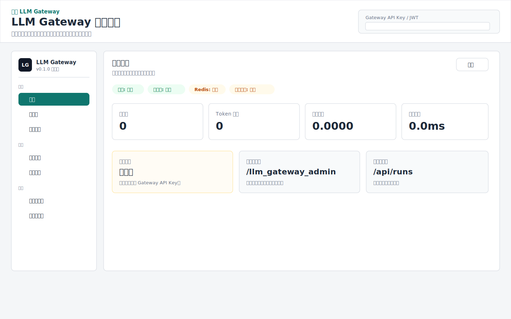
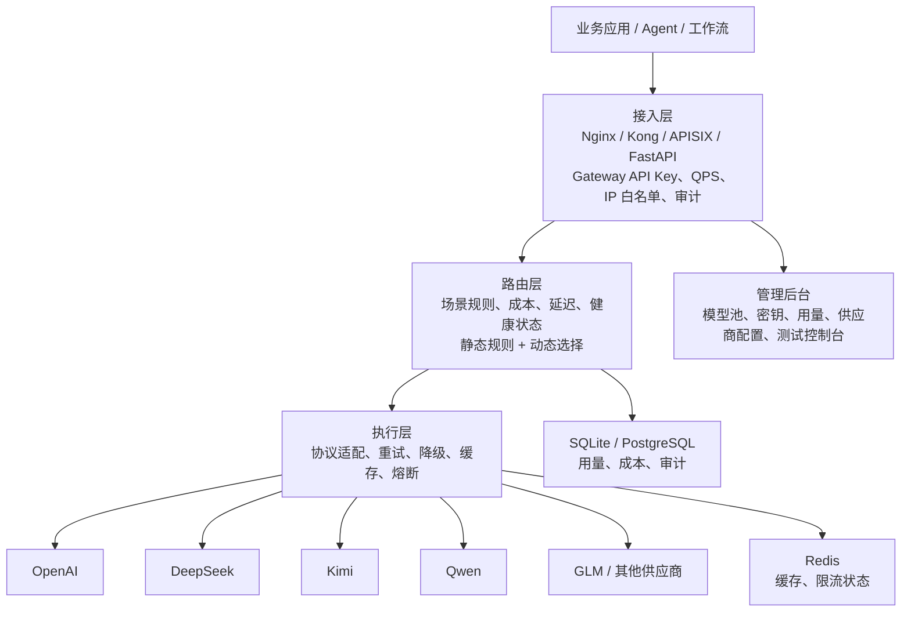

# LLM Gateway

统一的大模型路由网关，提供智能分层路由、负载均衡、统一鉴权和用量统计。

> 第三方应用通过标准 API 接入 LLM Gateway，无需直连各 LLM 提供商。

## What It Solves

- **统一入口**：企业内多模型、多供应商、多业务线共存时，业务侧只接入一套 Gateway API。
- **成本可见**：用量按 Gateway API Key、用户、模型和 tier 记录，可追踪测试流量和生产消耗。
- **自动降级**：供应商限流、宕机或模型异常时，网关侧可重试、熔断和 fallback。
- **权限隔离**：实习生、测试脚本和核心业务可以使用不同 Key、不同 QPS、不同模型 tier。
- **资源匹配**：简单任务走 cheap tier，复杂任务走 expensive tier，避免错配高价模型。
- **生产治理**：内置调用 Trace、管理审计、Provider SLA 聚合、策略草案和 Nginx 结构化日志。

## Admin UI

管理后台通过 Nginx 接入层访问，后端由 FastAPI 托管静态资源：

```text
http://localhost:8000/login
```



后台包含：运行概览、模型池、用量账单、调用追踪、SLA 看板、访问密钥、策略中心、审计日志、供应商配置和测试控制台。

## Documentation

| 文档 | 说明 |
|------|------|
| [架构说明](docs/architecture.md) | 三层架构、数据面、控制面和设计边界 |
| [需求清单](docs/requirements.md) | 已实现能力、待增强能力和非目标 |
| [API Reference](docs/api-reference.md) | 核心接口、认证接口、管理接口 |
| [运维指南](docs/operations.md) | 配额、限流、熔断、降级、缓存、成本 |
| [管理后台](docs/admin-ui.md) | `/admin` 页面结构和当前边界 |
| [Quickstart](docs/quickstart.md) | 从安装到打开后台的最短路径 |
| [Provider Setup](docs/provider-setup.md) | Gateway Key 和 Provider Key 的区别 |
| [Troubleshooting](docs/troubleshooting.md) | 402/403/429、鉴权和静态资源问题 |

## Architecture



当前 Docker Compose 已内置 Nginx 接入层。Nginx 是外部统一入口，FastAPI Gateway 位于内网，负责业务鉴权、模型路由、用量记录、降级和协议适配。后续如需企业级插件化治理，可把 `ingress` 从 Nginx 替换为 Kong 或 APISIX。

## Quick Start

### Docker Compose

```bash
git clone <repo>
cd llm_gateway
cp .env.example .env

# 编辑 .env，填入供应商 API Key
docker compose up -d --build --force-recreate
```

前端改动后建议单独重建前端镜像：

```bash
docker compose build frontend
docker compose up -d --force-recreate frontend ingress
```

Compose 会启动一个完整单栈（含独立前端服务）：

| 服务 | 说明 |
|------|------|
| `ingress` | Nginx 接入层，对外暴露 `${GATEWAY_PORT:-8000}`，负责统一入口、反向代理、基础限流和请求头透传 |
| `frontend` | 独立前端容器，构建并托管 React 管理后台（`/`, `/login`, `/admin`, `/llm_gateway_admin`） |
| `gateway` | FastAPI Gateway，提供 `/api/*`、鉴权、路由、运行态与治理能力，只在 Compose 内网暴露 `8000` |
| `redis` | 缓存、限流和运行时状态，只在 Compose 内网暴露，不直接对外开放 |
| `gateway_db` | SQLite 持久化 volume，保存 API Key、用量和成本记录 |
| `redis_data` | Redis AOF 持久化 volume |

治理数据也会落在 `gateway_db` volume 中：

- `request_traces`：每次调用的 request_id、模型、provider、fallback、cache、latency、错误类型。
- `audit_logs`：密钥、策略等管理操作审计。
- `policy_drafts`：策略草案快照，便于审查、回滚和后续生成 YAML。

打开：

```text
http://localhost:8000/login
```

验证：

```bash
curl http://localhost:8000/health
# {"status": "ok"}
```

创建演示用 Gateway API Key：

```bash
docker compose exec gateway python scripts/setup_test_key.py
```

然后在管理后台右上角填写：

```text
lgw_test_key_2026
```

### Local Development

本地开发适合改代码时使用；日常部署和演示推荐使用 Docker Compose。

```bash
uv sync
npm install --prefix frontend
npm run build --prefix frontend
uv run python scripts/setup_test_key.py
REDIS_URL=redis://127.0.0.1:6379/0 uv run uvicorn app.main:app --host 0.0.0.0 --port 8000
```

## Third-Party Integration Guide

### Step 1: 获取 API Key

首先需要一个有效的认证令牌（JWT 或已有的 API Key）来创建新的 Key：

```bash
curl -X POST http://localhost:8000/api/auth/keys \
  -H "Authorization: Bearer <your_jwt_or_admin_key>" \
  -d "name=my-application&quota=1000000&rate_limit=100"
```

响应：
```json
{
  "key": "lgw_abc123def456...",
  "id": "abc123def456",
  "name": "my-application"
}
```

**参数说明：**

| 参数 | 类型 | 默认值 | 说明 |
|------|------|--------|------|
| `name` | string | `"default"` | Key 的名称，用于标识用途 |
| `quota` | int | `0`（无限制） | 月度 token 配额 |
| `rate_limit` | int | `10` | 每秒请求数限制（QPS） |
| `allowed_tiers` | string | `"cheap,expensive"` | 可用模型层级，逗号分隔 |

> 返回的 `key` 是后续调用的唯一凭证，请妥善保管。

### Step 2: 发送对话请求

#### 非流式请求

```bash
curl -X POST http://localhost:8000/api/runs \
  -H "Authorization: Bearer lgw_abc123def456..." \
  -H "Content-Type: application/json" \
  -d '{
    "messages": [
      {"role": "system", "content": "你是一个专业的助手。"},
      {"role": "user", "content": "什么是负载均衡？"}
    ],
    "stream": false
  }'
```

响应：
```json
{
  "id": "run-deepseek-chat",
  "model": "deepseek-chat",
  "tier": "cheap",
  "content": "负载均衡是一种将网络流量分发到多个服务器的技术...",
  "usage": {
    "prompt_tokens": 15,
    "completion_tokens": 42,
    "total_tokens": 57
  },
  "finish_reason": "stop"
}
```

#### 流式请求（SSE）

```bash
curl -X POST http://localhost:8000/api/runs \
  -H "Authorization: Bearer lgw_abc123def456..." \
  -H "Content-Type: application/json" \
  -d '{
    "messages": [{"role": "user", "content": "写一首关于 AI 的诗"}],
    "stream": true
  }'
```

响应（Server-Sent Events）：
```
data: {"id": "run-deepseek-chat", "model": "deepseek-chat", "content": "AI", "finish_reason": null}

data: {"id": "run-deepseek-chat", "model": "deepseek-chat", "content": "，智慧", "finish_reason": null}

data: {"id": "run-deepseek-chat", "model": "deepseek-chat", "content": "之光", "finish_reason": null, "usage": {"prompt_tokens": 12, "completion_tokens": 58, "total_tokens": 70}}
```

每个 `data:` 行是一个独立的 JSON 对象。当 `finish_reason` 不为 `null` 时，流结束。最后一个 chunk 包含 `usage` 信息。

### Step 3: 查询用量

```bash
curl http://localhost:8000/api/auth/keys/abc123def456/usage \
  -H "Authorization: Bearer lgw_abc123def456..."
```

响应：
```json
{
  "total_tokens": 1520,
  "total_requests": 25,
  "total_cost_estimate": 0.052
}
```

### Step 4: 管理 API Keys

```bash
# 列出所有 Key
curl http://localhost:8000/api/auth/keys \
  -H "Authorization: Bearer lgw_abc123def456..."

# 删除 Key
curl -X DELETE http://localhost:8000/api/auth/keys/abc123def456 \
  -H "Authorization: Bearer lgw_abc123def456..."
```

## API Reference

所有接口（除 `/health` 外）均需 `Authorization: Bearer <api_key>` 请求头。

### Core

#### `POST /api/runs` — 发送对话请求

**请求体** (`ChatRequest`)：

| 字段 | 类型 | 默认值 | 必填 | 说明 |
|------|------|--------|------|------|
| `messages` | `Message[]` | — | 是 | 对话消息列表 |
| `stream` | `bool` | `false` | 否 | 是否使用流式响应 |
| `model_tier` | `string` | `"auto"` | 否 | 模型分层：`auto`、`cheap`、`expensive` |
| `tier` | `string` | — | 否 | `model_tier` 的别名 |
| `model` | `string` | `null` | 否 | 直接指定模型名称 |
| `preferred_model` | `string` | `null` | 否 | 优先使用的模型 |
| `fallback_model` | `string` | `null` | 否 | 降级模型 |
| `temperature` | `float` | `0.7` | 否 | 温度（0-2） |
| `max_tokens` | `int` | `4096` | 否 | 最大输出 token 数（1-128000） |
| `tools` | `ToolRef[]` | `[]` | 否 | 工具列表，用于规则匹配路由 |

**Message** 对象：

| 字段 | 类型 | 必填 | 说明 |
|------|------|------|------|
| `role` | `string` | 是 | `"system"`、`"user"`、`"assistant"`、`"tool"` |
| `content` | `string` | 是 | 消息内容 |
| `name` | `string` | 否 | 消息名称 |

**ToolRef** 对象（用于规则引擎匹配路由）：

| 字段 | 类型 | 必填 | 说明 |
|------|------|------|------|
| `name` | `string` | 是 | 工具名称 |
| `description` | `string` | 否 | 工具描述 |
| `parameters` | `object` | 否 | 工具参数 schema |

**路由逻辑**：
1. 指定 `model` → 直接使用
2. 指定 `model_tier` = `cheap` / `expensive` → 从该层选择模型
3. `model_tier` = `auto`（默认） → 规则引擎匹配 → AI 意图分类 → 决定 tier

**非流式响应** (`ChatResponse`)：

| 字段 | 类型 | 说明 |
|------|------|------|
| `id` | `string` | 请求 ID |
| `model` | `string` | 实际使用的模型 |
| `tier` | `string` | 模型分层 |
| `content` | `string` | 完整回复内容 |
| `usage` | `UsageInfo` | Token 用量 |
| `finish_reason` | `string` | 结束原因（`stop`、`length`、`error`） |

**流式响应**（SSE `ChunkResponse`）：

| 字段 | 类型 | 说明 |
|------|------|------|
| `id` | `string` | 请求 ID |
| `model` | `string` | 实际使用的模型 |
| `content` | `string` | 当前 chunk 的内容片段 |
| `finish_reason` | `string \| null` | 结束时不为 `null` |
| `usage` | `UsageInfo \| null` | 仅在最后一个 chunk 出现 |

**UsageInfo**：

| 字段 | 类型 | 说明 |
|------|------|------|
| `prompt_tokens` | `int` | 输入 token 数 |
| `completion_tokens` | `int` | 输出 token 数 |
| `total_tokens` | `int` | 总 token 数 |

---

### Auth

#### `POST /api/auth/keys` — 创建 API Key

| 参数 | 类型 | 默认值 | 说明 |
|------|------|--------|------|
| `name` | query string | `"default"` | Key 名称 |
| `quota` | query int | `0` | 月度 token 配额（0 = 无限制） |
| `rate_limit` | query int | `10` | QPS 限制 |
| `allowed_tiers` | query string | `"cheap,expensive"` | 可用模型层级，逗号分隔 |

**响应**：`{"key": "lgw_...", "id": "...", "name": "..."}`

#### `GET /api/auth/keys` — 列出 API Keys

**响应**：`[{id, name, quota_monthly, rate_limit_rps, allowed_tiers, created_at}]`

#### `GET /api/auth/keys/{key_id}/usage` — 查询用量

**响应**：`{total_tokens, total_requests, total_cost_estimate}`

用量会按 `api_key_id` 写入 `usage_logs`，因此可以区分不同业务线、测试 key 和核心业务 key 的 token 与成本。

#### `GET /api/usage` — 查询用量明细和聚合

支持 `key_id`、`model`、`tier`、`limit`、`offset` 等查询参数。

#### `DELETE /api/auth/keys/{key_id}` — 删除 Key

**响应**：`{"deleted": true}`

---

### Admin

#### `GET /api/models` — 列出可用模型

**响应**：
```json
{
  "deepseek-chat": {
    "tier": "cheap",
    "healthy": true,
    "connections": 5,
    "errors": 0
  },
  "gpt-5.4": {
    "tier": "expensive",
    "healthy": true,
    "connections": 2,
    "errors": 0
  }
}
```

#### `GET /api/models/{model_name}/health` — 模型健康状态

**响应**：`{"name": "deepseek-chat", "tier": "cheap", "healthy": true, "connections": 5, "errors": 0, "status": "healthy"}`

#### `GET /api/metrics` — 网关指标摘要

#### `GET /api/config` — 脱敏后的网关和模型配置

Provider `api_keys` 字段始终返回空数组。

---

### Admin UI

#### `GET /admin` — 管理后台页面

提供 Overview、API Keys、Models & Routing、Test Console 四个操作区域。

---

### Health

#### `GET /health` — 健康检查（无需鉴权）

**响应**：`{"status": "ok"}`

---

## Error Codes

| HTTP 状态码 | 场景 | 说明 |
|-------------|------|------|
| `401` | 鉴权失败 | 缺少或无效的 API Key / JWT |
| `429` | 限流 | 超过 QPS 配额或月度 token 配额 |
| `502` | 模型错误 | 下游 LLM 提供商返回错误 |
| `503` | 无可用模型 | 所选 tier 没有健康的模型 |
| `504` | 超时 | 模型请求超时 |

**错误响应格式**：
```json
{
  "error": "Rate limit exceeded",
  "code": "rate_limit",
  "details": "User exceeded 10 QPS limit"
}
```

## Client Examples

### Python (httpx)

```python
import httpx

GATEWAY_URL = "http://localhost:8000"
API_KEY = "lgw_abc123..."

# 非流式
async def chat(messages: list[dict]) -> str:
    async with httpx.AsyncClient() as client:
        resp = await client.post(
            f"{GATEWAY_URL}/api/runs",
            headers={"Authorization": f"Bearer {API_KEY}"},
            json={"messages": messages, "stream": False},
        )
        data = resp.json()
        return data["content"]

# 流式
async def chat_stream(messages: list[dict]):
    async with httpx.AsyncClient() as client:
        async with client.stream(
            "POST",
            f"{GATEWAY_URL}/api/runs",
            headers={"Authorization": f"Bearer {API_KEY}"},
            json={"messages": messages, "stream": True},
        ) as resp:
            async for line in resp.aiter_lines():
                if line.startswith("data: "):
                    chunk = json.loads(line[6:])
                    yield chunk["content"]
                    if chunk.get("finish_reason"):
                        break
```

### JavaScript (fetch)

```javascript
const GATEWAY_URL = "http://localhost:8000";
const API_KEY = "lgw_abc123...";

// 非流式
async function chat(messages) {
  const resp = await fetch(`${GATEWAY_URL}/api/runs`, {
    method: "POST",
    headers: {
      "Authorization": `Bearer ${API_KEY}`,
      "Content-Type": "application/json",
    },
    body: JSON.stringify({ messages, stream: false }),
  });
  const data = await resp.json();
  return data.content;
}

// 流式 (SSE)
async function* chatStream(messages) {
  const resp = await fetch(`${GATEWAY_URL}/api/runs`, {
    method: "POST",
    headers: {
      "Authorization": `Bearer ${API_KEY}`,
      "Content-Type": "application/json",
    },
    body: JSON.stringify({ messages, stream: true }),
  });
  const reader = resp.body.getReader();
  const decoder = new TextDecoder();
  let buffer = "";

  while (true) {
    const { done, value } = await reader.read();
    if (done) break;
    buffer += decoder.decode(value, { stream: true });
    const lines = buffer.split("\n");
    buffer = lines.pop(); // keep incomplete line

    for (const line of lines) {
      if (line.startsWith("data: ")) {
        const chunk = JSON.parse(line.slice(6));
        yield chunk.content;
        if (chunk.finish_reason) return;
      }
    }
  }
}
```

### OpenAI SDK 兼容

Gateway 的 `/api/runs` 接口使用自定义请求格式，**不直接兼容** OpenAI SDK。如需使用 OpenAI SDK，可以自行添加一个 `/v1/chat/completions` 兼容端点。

## Configuration

### 环境变量 (`.env`)

```bash
# 各 LLM 提供商 API Key
OPENAI_API_KEY=sk-...
ANTHROPIC_API_KEY=sk-ant-...
QWEN_API_KEY=sk-...
DEEPSEEK_API_KEY=sk-...
KIMI_API_KEY=sk-...
LINGYA_API_KEY=sk-...
GLM_API_KEY=...

# 网关配置
GATEWAY_JWT_SECRET=your-secret-key-change-in-production
REDIS_URL=redis://localhost:6379/0
```

### 网关配置 (`config/gateway.yaml`)

```yaml
server:
  host: "0.0.0.0"
  port: 8000

auth:
  jwt_secret: ""              # 留空则从环境变量 GATEWAY_JWT_SECRET 读取
  jwt_algorithm: "HS256"
  api_key_prefix: "lgw_"      # API Key 前缀

rate_limit:
  default_rps: 10             # 默认每秒请求数
  burst_multiplier: 2         # 突发倍率

timeouts:
  intent_classification: 2    # 意图分类超时（秒）
  model_request: 60           # 模型请求超时（秒）
  stream_idle: 30             # 流式空闲超时（秒）

# 路由规则 — 按需修改
rules:
  - name: "general_query"
    match:
      max_content_tokens: 200  # 短请求自动走 cheap
    tier: cheap
```

### 模型配置 (`config/models.yaml`)

```yaml
models:
  - name: "deepseek-chat"
    tier: cheap                # 或 expensive
    weight: 2                  # 负载均衡权重
    provider: deepseek         # 对应 providers 配置
    max_concurrent: 150        # 最大并发
    rate_limit: 1500           # 每分钟请求数

providers:
  deepseek:
    base_url: "https://api.deepseek.com/v1"
  # 其他提供商...
```

> 添加新模型：在 `models` 列表中新增条目即可，无需修改代码。

## Supported Providers

| Provider | 配置名 | 默认端点 |
|----------|--------|----------|
| OpenAI | `openai` | `https://api.openai.com/v1` |
| Anthropic | `anthropic` | `https://api.anthropic.com` |
| 通义千问 | `qwen` | `https://dashscope.aliyuncs.com/compatible-mode/v1` |
| DeepSeek | `deepseek` | `https://api.deepseek.com/v1` |
| Kimi 开放平台 | `kimi` | `https://api.moonshot.ai/v1` |
| Kimi Code 会员权益 | `kimi_code` | `https://api.kimi.com/coding/v1` |
| 灵牙 | `lingya` | `https://api.lingyaai.cn/v1` |
| 智谱 | `glm` | `https://open.bigmodel.cn/api/paas/v4` |

Kimi 有两套不同入口：开放平台按量付费使用 `KIMI_API_KEY` 和 `kimi-k2.5`；Kimi Code 会员权益使用 `KIMI_CODE_API_KEY` 和固定模型 ID `kimi-for-coding`。

## Deployment

### Docker Compose

```yaml
services:
  gateway:
    build: .
    ports:
      - "8000:8000"
    environment:
      - REDIS_URL=redis://redis:6379/0
      - GATEWAY_JWT_SECRET=change-me
    volumes:
      - ./config:/app/config
      - ./data:/app/data
    depends_on:
      - redis

  redis:
    image: redis:7-alpine
    ports:
      - "6379:6379"
```

### Production Checklist

- [ ] 设置强 `GATEWAY_JWT_SECRET`
- [ ] 配置 HTTPS（反向代理）
- [ ] 调整 `rate_limit` 适配你的场景
- [ ] 监控 `/api/metrics` 指标
- [ ] 配置日志收集
- [ ] 生产环境使用 PostgreSQL 替代 SQLite（修改 `app/db/sqlite.py`）
