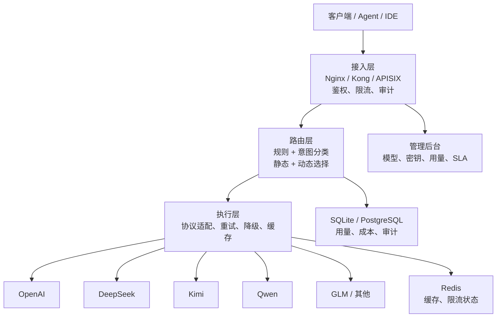

<p align="center">
  <h1 align="center">LLM Gateway</h1>
  <p align="center">
    <a href="https://github.com/xuehaoweng/Keystone/actions/workflows/ci.yml"></a>
    
    
    
  </p>
  <p align="center">
    <b>统一的大模型路由网关，提供智能分层路由、成本治理和多协议兼容。</b><br/>
    <b>Unified LLM routing gateway with intelligent tier-based routing, cost control, and multi-protocol compatibility.</b>
  </p>
  <p align="center">
    <a href="#快速开始">快速开始</a> •
    <a href="#功能特性">功能特性</a> •
    <a href="#与-litellm-的区别">与 LiteLLM 的区别</a> •
    <a href="#使用方式">使用方式</a> •
    <a href="#架构">架构</a> •
    <a href="README.md">English</a>
  </p>
</p>

---

## 解决的问题

- **统一入口**：企业内多模型、多供应商、多业务线共存时，业务侧只接入一套 Gateway API。
- **成本可见**：用量按 Gateway API Key、用户、模型和 tier 记录，可追踪测试流量和生产消耗。
- **自动降级**：供应商限流、宕机或模型异常时，网关侧可重试、熔断和 fallback。
- **权限隔离**：实习生、测试脚本和核心业务可以使用不同 Key、不同 QPS、不同模型 tier。
- **资源匹配**：简单任务走 cheap tier，复杂任务走 expensive tier，避免错配高价模型。
- **生产治理**：内置调用 Trace、管理审计、Provider SLA 聚合、策略草案和 Nginx 结构化日志。

## 快速开始

```bash
git clone git@github.com:xuehaoweng/Keystone.git
cd Keystone
cp .env.example .env
# 编辑 .env，填入供应商 API Key
docker compose up -d --build --force-recreate
```

打开管理后台：
```text
http://localhost:8000/login
```

创建演示密钥：
```bash
docker compose exec gateway python scripts/setup_test_key.py
# 在管理后台右上角填入 lgw_test_key_2026
```

## 功能特性

| 特性 | 说明 |
|------|------|
| **OpenAI 兼容 API** | 即插即用的 `/v1/chat/completions`，支持任意 OpenAI SDK 客户端 |
| **Anthropic 兼容 API** | 原生 `/v1/anthropic` 端点，支持 Claude Code 和 Anthropic SDK |
| **原生 Gateway API** | `/api/runs`，带路由元数据、意图分类和规则引擎 |
| **意图分类** | AI 分析提示复杂度，简单任务路由到 cheap 模型，复杂任务路由到 expensive 模型（~10ms 开销） |
| **静态规则引擎** | 支持基于工具、关键词和内容长度的确定性路由 |
| **分层访问控制** | `cheap` / `expensive` tier，可按 Key 强制限制 |
| **自动降级** | 非流式请求在模型失败时自动重试下一个健康模型 |
| **熔断器** | 连续失败触发冷却期，自动恢复 |
| **结果缓存** | 低温度非流式响应写入 Redis 缓存 |
| **用量追踪** | 按 Key 统计 token、延迟和预估成本，持久化到 SQLite |
| **管理后台** | React 可视化界面，管理密钥、模型、路由规则、测试控制台和 SLA 监控 |
| **多供应商** | OpenAI、Anthropic、DeepSeek、Kimi（含会员权益）、Qwen、GLM、灵牙 |

## 与 LiteLLM 的区别

| | **本网关** | **LiteLLM** |
|---|---|---|
| **意图路由** | AI 分类提示复杂度，自动路由到 cheap/expensive 分层 | 仅支持加权轮询 |
| **静态规则** | 工具/关键词/长度规则实现确定性路由 | 无内置规则引擎 |
| **分层管控** | 按 Key 限制 `allowed_tiers` | 仅预算控制 |
| **数据库** | SQLite 开箱即用 | 管理功能依赖 PostgreSQL |
| **依赖体积** | 单镜像，依赖精简 | Python 依赖树较大 |
| **国产模型** | 原生支持 DeepSeek、Kimi、Qwen、GLM、灵牙 | 依赖社区适配 |

需要 **100+ 供应商、团队管理、庞大社区** → 选 **LiteLLM**。  
需要**智能成本感知路由、分层治理、轻量部署、强国产模型支持** → 选 **本网关**。

## 使用方式

### OpenAI SDK（Cursor、Continue、Copilot 等）

```python
import openai

client = openai.OpenAI(
    api_key="lgw_xxx",
    base_url="http://localhost:8000/v1",
)

# 省略 model，让网关通过意图分类自动路由
client.chat.completions.create(
    messages=[{"role": "user", "content": "Explain quantum computing"}],
    stream=True,
)
```

### Claude Code

```bash
# 方式一：OpenAI 兼容模式
claude config set apiProvider openai
claude config set apiUrl http://localhost:8000/v1
export CLAUDE_CODE_API_KEY="lgw_xxx"

# 方式二：Anthropic 原生模式
claude config set apiProvider anthropic
claude config set apiUrl http://localhost:8000
export ANTHROPIC_API_KEY="lgw_xxx"
```

### Anthropic SDK

```python
import anthropic

client = anthropic.Anthropic(
    api_key="lgw_xxx",
    base_url="http://localhost:8000",
)

client.messages.create(
    model="claude-sonnet-4",
    max_tokens=1024,
    messages=[{"role": "user", "content": "Hello!"}],
)
```

### 原生 Gateway API

```bash
curl -X POST http://localhost:8000/api/runs \
  -H "Authorization: Bearer lgw_xxx" \
  -H "Content-Type: application/json" \
  -d '{
    "messages": [{"role": "user", "content": "Hello"}],
    "stream": false
  }'
```

## 架构



## 支持供应商

| 供应商 | 配置名 | 默认端点 |
|--------|--------|----------|
| OpenAI | `openai` | `https://api.openai.com/v1` |
| Anthropic | `anthropic` | `https://api.anthropic.com` |
| DeepSeek | `deepseek` | `https://api.deepseek.com/v1` |
| Kimi 开放平台 | `kimi` | `https://api.moonshot.ai/v1` |
| Kimi Code 会员权益 | `kimi_code` | `https://api.kimi.com/coding/v1` |
| 通义千问 | `qwen` | `https://dashscope.aliyuncs.com/compatible-mode/v1` |
| 智谱 GLM | `glm` | `https://open.bigmodel.cn/api/paas/v4` |
| 灵牙 | `lingya` | `https://api.lingyaai.cn/v1` |

## 文档

| 文档 | 说明 |
|------|------|
| [架构说明](docs/architecture.md) | 三层架构、数据面、控制面和设计边界 |
| [API Reference](docs/api-reference.md) | 核心接口、认证接口、管理接口 |
| [运维指南](docs/operations.md) | 配额、限流、熔断、降级、缓存、成本 |
| [管理后台](docs/admin-ui.md) | `/admin` 页面结构和当前边界 |
| [Quickstart](docs/quickstart.md) | 从安装到打开后台的最短路径 |
| [Provider Setup](docs/provider-setup.md) | Gateway Key 和 Provider Key 的区别 |
| [Troubleshooting](docs/troubleshooting.md) | 402/403/429、鉴权和静态资源问题 |

## 许可证

MIT License — 详见 [LICENSE](LICENSE)。

---

<p align="center">
  🌏 <a href="README.md"><b>English Documentation</b></a> available
</p>
